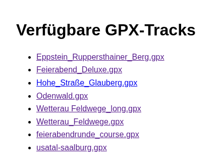

# How to deploy this example

This example application is a simple Node.js application which will create an index.html file. The content of this index page is a simple list of GPS tracks.


Those tracks are located in the folder [public/gpx]() as ... gpx files.

Once you click on the GPS track of choice a new page opens up and will render a map with your track on it.



The beauty of this example is that you can add your own tracks as *gpx* file in the folder [public/gpx] of your GIT repository and by rebuilding the application in OpenShift a new index page will be created and your new track will be available.

The first steps can be skipped but they give a good overview how you can start from scratch with any project.

* [1 - Deploy the app a first time](docs/1-base-app-build.md)
* [2 - Create the yaml artefacts](docs/2-base-create-artefacts.md)

If you would like to move forward with your own artefacts, feel free to do so. The following examples will all refer to the existing example in the GIT repo. So you might want to delete the work you did so far in OpenShift by deleting the project
```oc delete project gpx-viewer```

In the next section we will use ArgoCD to deploy our application.

.... here comes the ArgoCD approach


|Navigation|-|-|
|:-------:|:-------:|:-------:|
|---|---|[-> NEXT](docs/1-base-app-build.md)|

## References

[ArgoCD and ArgoCD instance RBAC](https://github.com/lenocruz/jvm/blob/main/instructions.txt)

[ArgoCD RBAC details](https://github.com/argoproj/argo-cd/blob/master/docs/operator-manual/rbac.md)

[Multi user example](https://github.com/manfredmuth/openshift-gitops-setup)