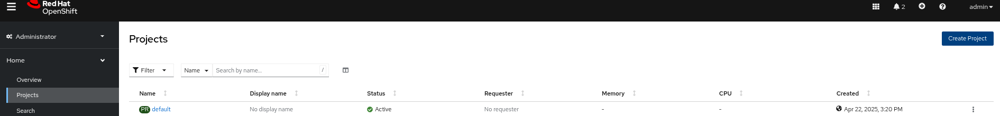
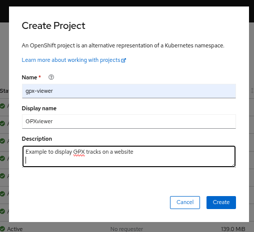
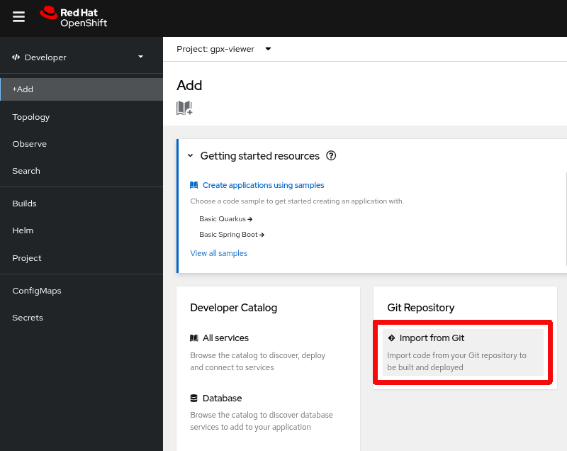
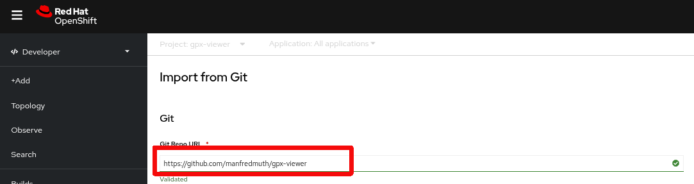

# Build base app

This is the first step and the only purpose is to ckech if a manual deployment of the application does work on your cluster. Therefor the deployment artefacts are available in the root tree of this repo. And those are:
* [server.js](../server.js)
* [package.json](../package.json)

Those files are key for your Node.js application.

**Create a new project**

**Create a new project and add some details** if you like

**Add a deployment**

Check that you are in *developer* view

**Add a deplyoment from GIT**

Check that you import from GIT

**Add a deplyoment from GIT**

Add the GIT repo path here

You want to make sure that:
* Once you added the Git repo you see that a builder image was detected

* That you use a secure route by default. You do need to provide signed certificates if you do not have access to such certificates. OpenShift will generate a local certificate on your behalf.

Now hit **Create** and obey to the demo gods ....

It will take a few seconds and you should see in the topology view a ready to use application. The route to your application is accessible via the link which is marked ....

The next step is to create the deployment config.

|Navigation|-|-|
|:-------:|:-------:|:-------:|
|[README](../README.md)|...|[-> NEXT](./2-base-create-artefacts.md)|
