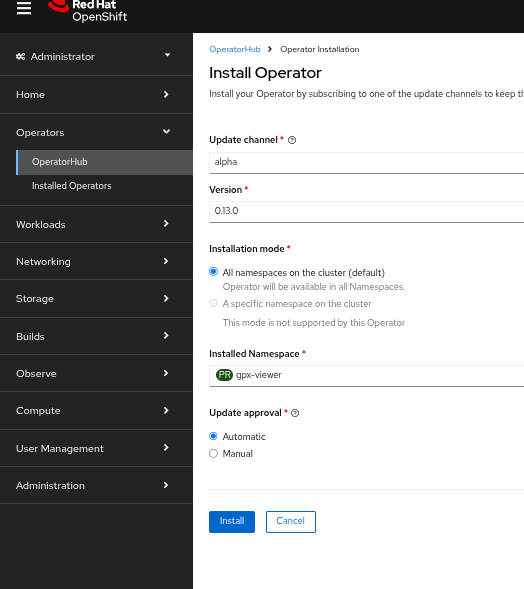

# ArgoCD

In case you skipped the previous steps - no worries - this should work from here out of the box.

We will install the application with help of ArgoCD and for this purpose we first need an ArgoCD installation.
- We willinstall ArgoCD as operator
- The operator will reside in the namespace which will have your app later (we do so in order to avoid RBAC and role binding difficulties)

**Navigate in the Administrator view to the operator hub and choose ArgoCD**

**Chosse the ArgoCD operator**

**Install the operator and make sure you create a separate namespace for it**

**Name the ArgoCD namespace as per your personal preferences**

**Finally install the operator**

**With a little patience ... you will see the operator is installed**

Navigate to the Operators and check the installed operators view. You should see a successfully installed ArgoCD operator

Next step will be to create an ArgoCD instance and to deploy your application at the same time ....

|Navigation|-|-|
|:-------:|:-------:|:-------:|
|[README](../README.md)|[BACK](./2-base-create-artefacts.md)|[-> NEXT](./4-argo.md)|
