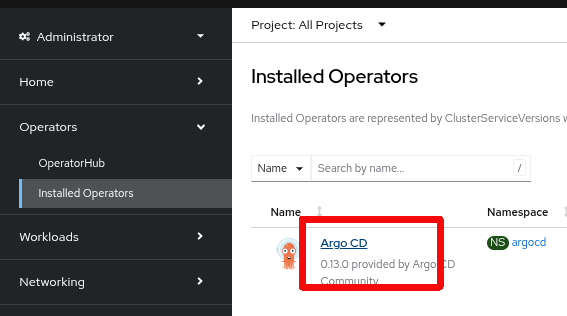
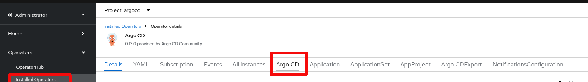
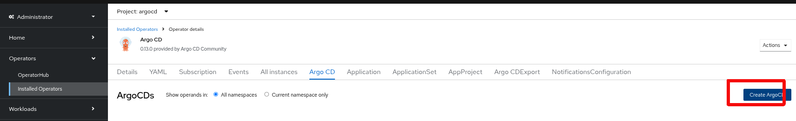
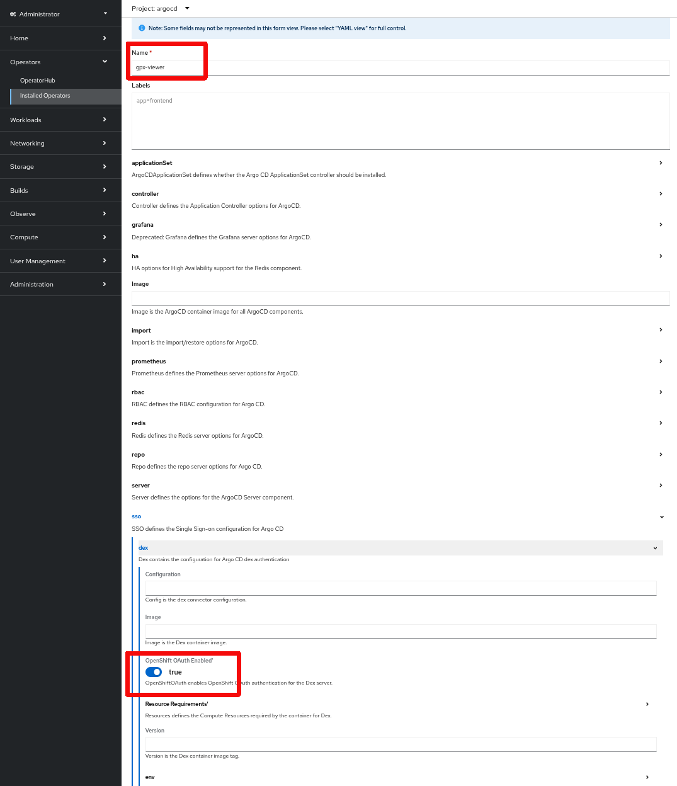
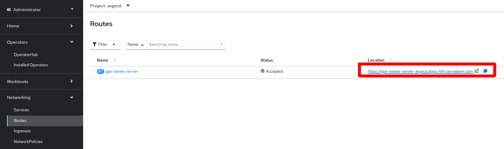

# Create your application with ArgoCD

Why should you do so? You might ask yourself.

ArgoCD is the GITOPS why to deploy your application. Not only will ArgoCD keep your deployed application synchronized with the respective branch in your repository.
You will also be able to deploy your application from scratch in case somebody - by incident - deleted your namespace.

So what we will do here is
- To create an ArgoCD instance
- Using an S2I approach for our Node.js example

**Create an ArgoCD instance**

Navigate to the Operator view and choose the installed ArgoCD.



**Choose ArgoCD**





**Create a new instance**

Just in order to keep things simple enough for now we only change two things.

- we create an instance called *gpx-viewer* but you are free to choose at this point
- we enable OpenShift OAtuh authentication



Now we need to login to our ArgoCD - for this purpose you simply navigate to project argocd -> Networking routes.

```oc get routes -n argocd```



Open the link and login - as we enabled OpenShift OAuth you can use a user you already use, when you login in to your OpenShift cluster.

The main view of ArgoCD will open up.

What we will do next is that we will create a new application. And be aware that in our OpenShift cluster there is not yet a project called gpx-viewer. All tasks will be carried out by ArgoCD.
In case you created your own yaml artefacts as per [YAML artefact creation](./2-base-create-artefacts.md) and might did chosse another namespace name. Please change it in the ArgoCD app creation form view accordingly.


|[README](../README.md)|[BACK](./3-argo.md)|[-> NEXT](../README.md)|