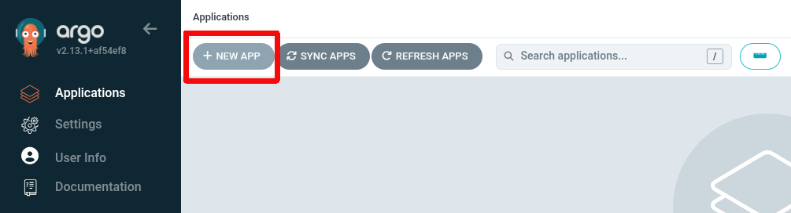
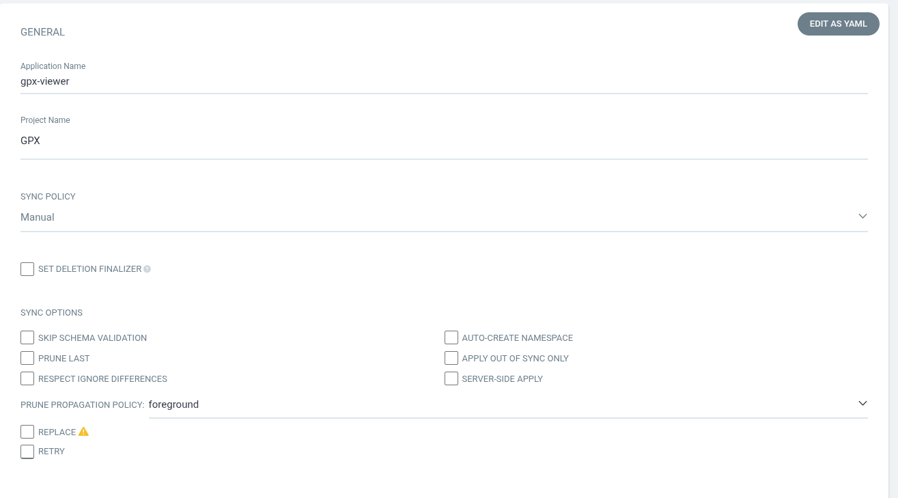
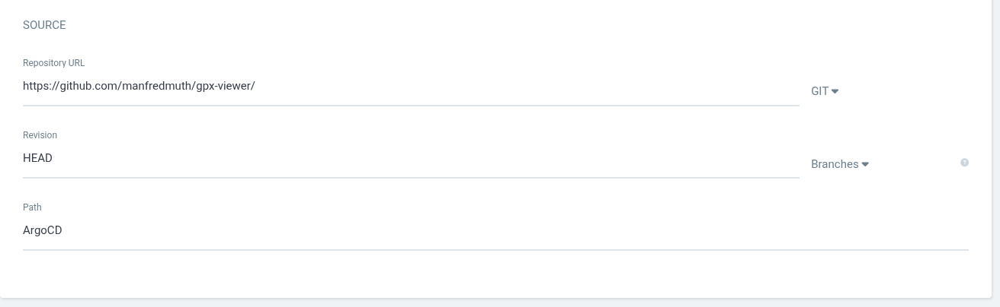
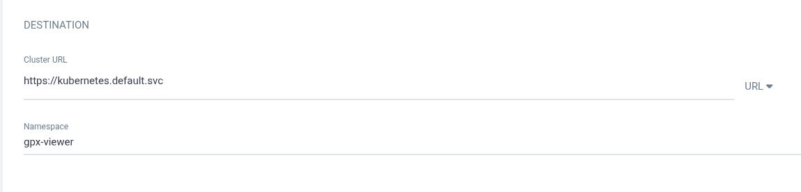
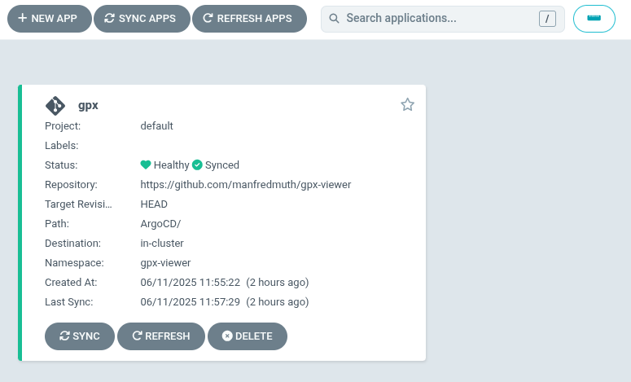

# Creating a new application in ArgoCD

What we will do in this section

- Install the GitOps operator
- Add a new application in ArgoCD
- Refer to the GIT repo and the according path to the yaml aretacts
- Advice ArgoCD to create it in a namespace

**Prepare the environment**
[See the steps here in argocd_operator.md documentation for an automated approach](../src/argocd_operator.md)

Fill in the details which match your purpose

The source is your GIT repository and the name of the GIT subtree which hosts your app. In case you did create your own artefacts as described in [Create deployment artefacts](../docs/2-base-create-artefacts.md) you might need to switch to subtree 'k8s'.

Use the kubernetes cluster. In case this is not visible here. The user you currently use does not have the right privileges.

You now have an application which you can use.

.... ENJOY ...

|[README](../README.md)|[ BACK ](../docs/4-argo.md)|[ --- ]|